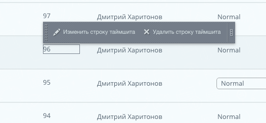

# Hermitage_Bitrix
## Технология эрмитаж <b>без компонента</b>

### Как добавить кнопки «Изменить элемент», «Добавить элемент», «Удалить элемент» в 1С-Битрикс


Итак, разбираем AddEditAction — первый параметр айди элемента, второй ссылка на экшен, третий текст кнопки. Обратите внимание, что для удаление используется AddDeleteAction, где мы передаем четвертым параметром подтверждение через алерт браузера.


```php
// Получаем ссылки для редактирования и удаления элемента
  $arButtons = CIBlock::GetPanelButtons(
      $arItem["IBLOCK_ID"],
      $arItem["ID"],
      0,
      array("SECTION_BUTTONS"=>false, "SESSID"=>false)
  );
  $arItem["EDIT_LINK"] = $arButtons["edit"]["edit_element"]["ACTION_URL"];
  $arItem["DELETE_LINK"] = $arButtons["edit"]["delete_element"]["ACTION_URL"];

  // Вызываем действия для элемента методами AddEditAction, AddDeleteAction
  $comp = new CBitrixComponent;
  $comp->AddEditAction($sheetRow[ID], $sheetRow['EDIT_LINK'], CIBlock::GetArrayByID($arItem["IBLOCK_ID"], "ELEMENT_EDIT"));
  $comp->AddDeleteAction($sheetRow[ID], $sheetRow['DELETE_LINK'], CIBlock::GetArrayByID($arItem["IBLOCK_ID"], "ELEMENT_DELETE"), array("CONFIRM" => GetMessage('CT_BNL_ELEMENT_DELETE_CONFIRM')));
?>
```
Чтобы это заработало, блоку нужно передать id:

```html
  <div id="<?=$comp->GetEditAreaId($sheetRow[ID])?>">Элемент, который выделится эрмитажем</div>
```
